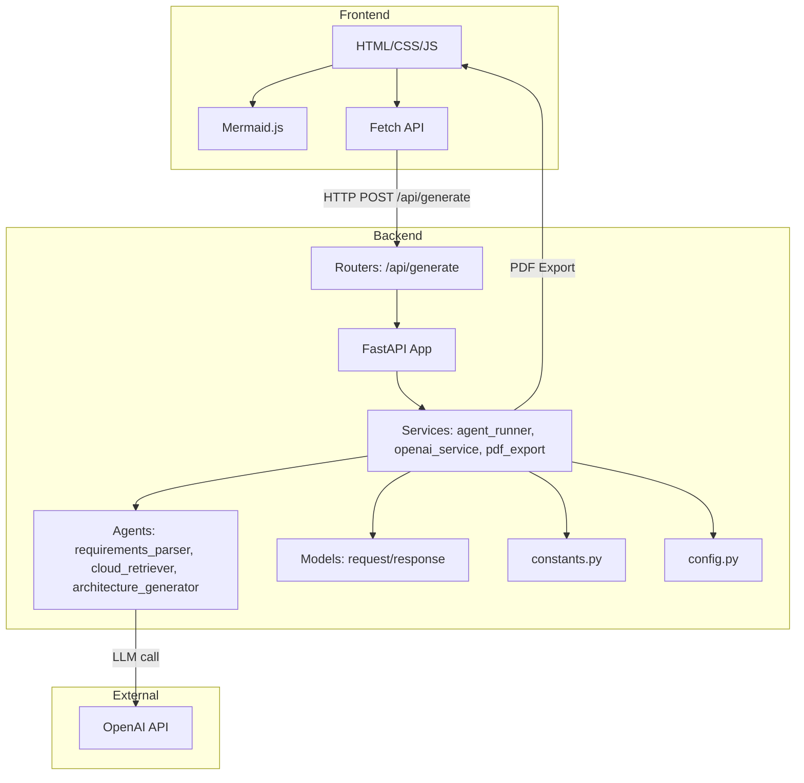

# AI System Design Architect



An AI-powered system design tool that generates architecture diagrams using natural language requirements.

## Features

- Natural language processing of system requirements
- Automatic generation of system architecture diagrams using Mermaid
- AWS service integration and cost estimation
- Export to PDF functionality

## Setup

1. Create a virtual environment:
```bash
uv venv .venv
source .venv/bin/activate  # Unix/MacOS
.venv\Scripts\activate     # Windows
```

2. Install dependencies:
```bash
uv pip install -r backend/requirements.txt
```

3. Configure environment variables in `.env`:
```
OPENAI_API_KEY=your_key_here
AWS_ACCESS_KEY_ID=your_key_here
AWS_SECRET_ACCESS_KEY=your_key_here
```

4. Run the backend:
```bash
cd backend
uvicorn main:app --reload
```

5. Open `frontend/index.html` in your browser

## Usage

1. Enter your system requirements in natural language
2. Click "Generate Design"
3. View the generated architecture diagram
4. Optionally export to PDF
